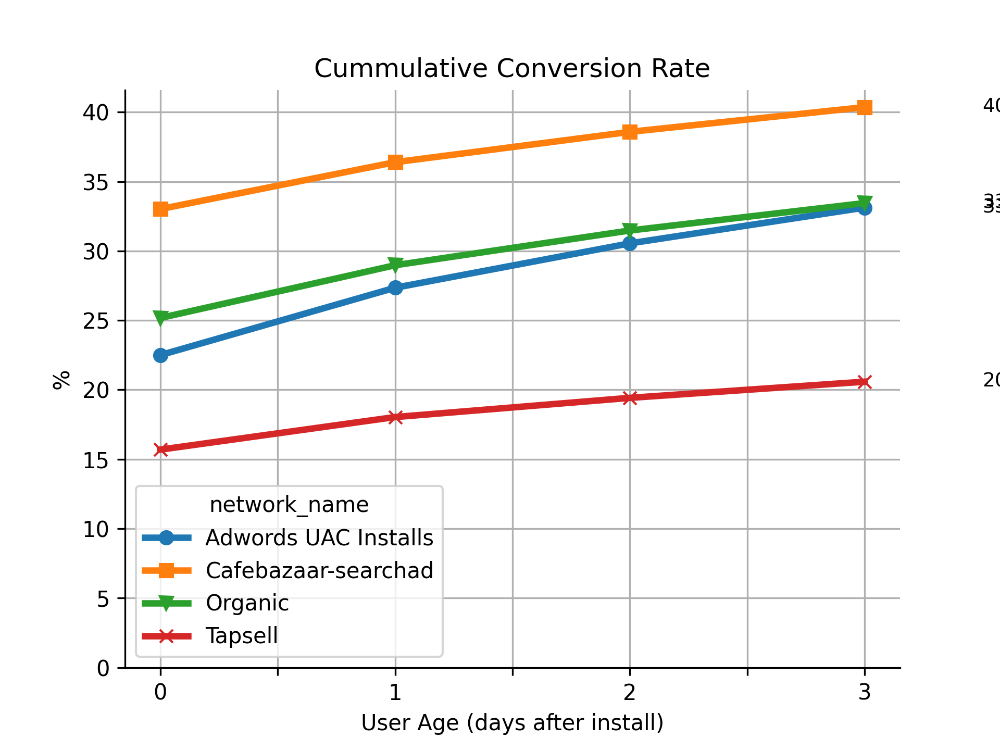
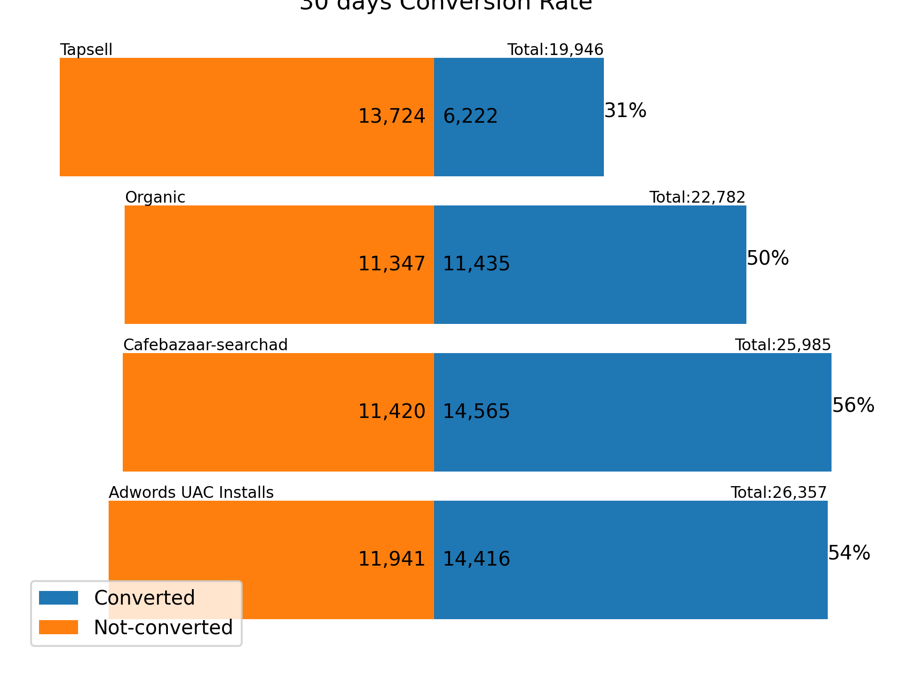
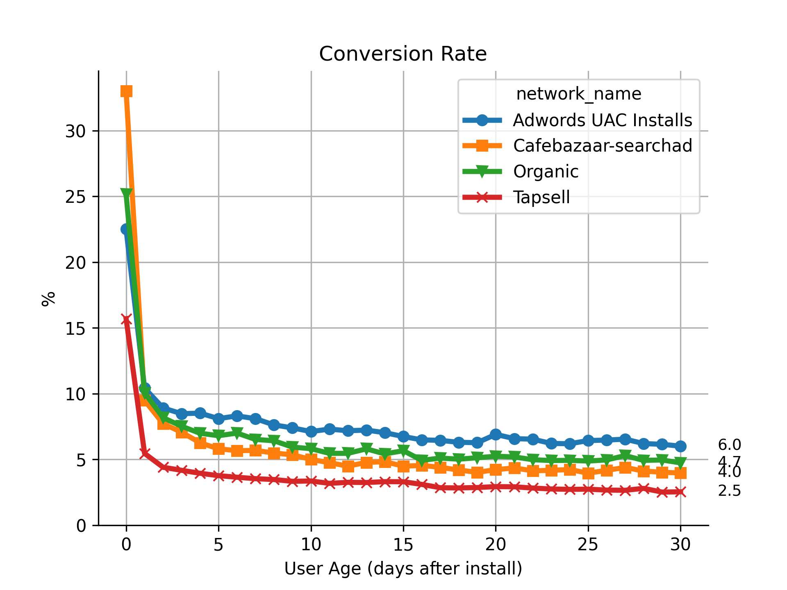
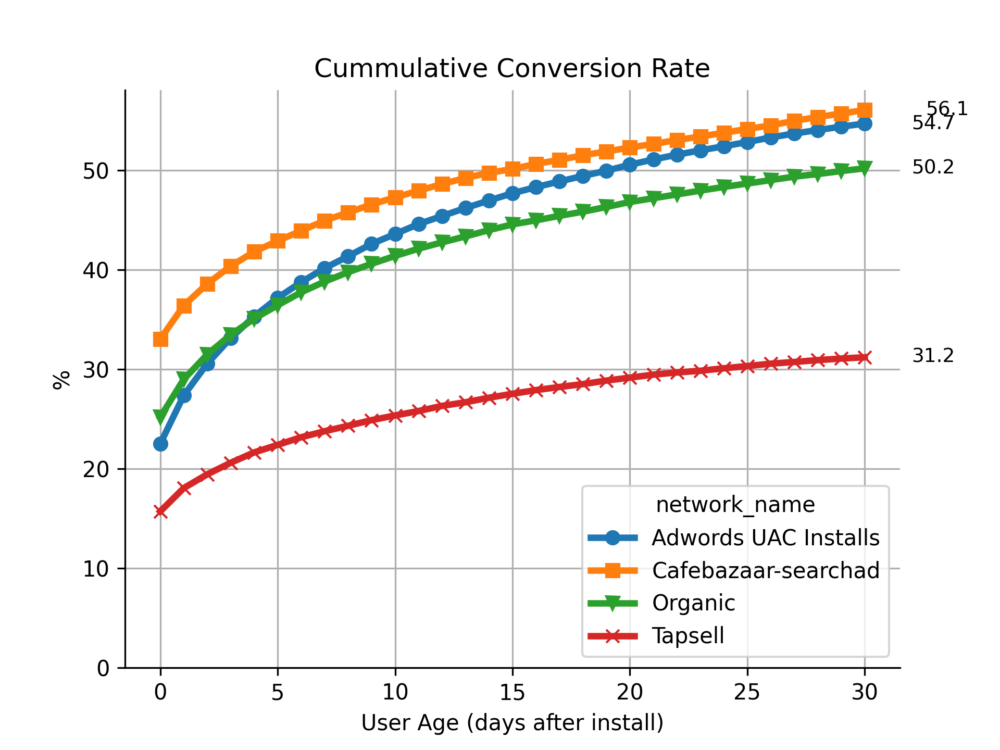

# Ads-Networks-Performance-and-Fraud-Analysis ** – CafeBazaar**

📅 Mehr 1398 (October 2019)

---

## **Challenge Response**

### **1. Data Cleaning**

Several issues were found and addressed:

* **Duplicate Records:**
  Some users had multiple installation records. Only the first valid record per user was kept.

* **Format Inconsistencies:**

  * The `created_at` column had inconsistent timestamp formats, which were standardized.
  * Logical consistency of timestamps between installation and events was verified.

* **Missing Records:**

  * No NULL values found in any fields.
  * Over 5,000 users had only event records and no corresponding install records. These were treated as potential anomalies.

---

## **2. Conversion Rate – 3-Day Active Users**

### **Key Insights:**

* **Highest conversion rate (within 3 days)** belongs to **CafeBazaar Search Ads** users.
* **Adwords** and **Organic** follow closely.
* **Tapsell** users show the **lowest** conversion rate across the period.

### **Detailed Findings:**

* **CafeBazaar SearchAd** users:

  * \~56% of users converted in the first 3 days.
  * \~40% retained by day 30.

* **Adwords**:

  * Highest same-day conversion rate.
  * Gradually increased and reached \~54% by day 30.

* **Tapsell**:

  * Lowest 3-day and 30-day conversion rates.

**Cumulative 3-Day Conversion by Network**

**3-Day Conversion Rate Comparison per Network**

**Daily Independent Conversion Rates**

 

**Cumulative Conversion to Day 30**

---

## **3. Retention – 30-Day Active Users**

### **Key Insights:**

* **Adwords** users had the **highest 30-day retention (\~71%)**.
* Followed by **Organic**, then **Tapsell** and **CafeBazaar SearchAd**.
* **Adwords** users also demonstrated the highest **Lifetime Value (LTV)** based on event frequency.

### **Detailed Findings:**

* On average, active users performed **26 events** within 30 days of activation.
* **CafeBazaar SearchAd** users had the **lowest LTV** (\~16 events per user).

### **Analysis:**

* \~64% of active users remained active during the 30-day window.
* Specifically, **7.5%** of all users were still active on **Day 30**.

### **Charts Used:**

1. **Cumulative Retention Curve – 30 Days**
2. **Daily Retention Curve**
3. **LTV Curve (Average Events per User)**

---

## **4. Fake Installs – Users Who Never Became Active**

### **Key Insights:**

* **Tapsell** network showed a **suspiciously high rate of fake installs**.

### **Analysis:**

* **Unnatural Install Patterns**:

  * Large volume of installs during late-night hours, not aligned with user behavior in other networks.
  * Other networks showed a natural low rate of installs at night.

* **Fake Install Indicators**:

  * Irregular and high install rates.
  * Very low or zero activation after install.
  * Install behavior inconsistent with daily human activity.

### **Charts Used:**

* **Install Count by Hour and Network**
* **Fake Install Rate by Hour and Day**
* **Comparison of Hourly Patterns Across Networks**

---

## **5. Suspicious Behavior Summary**

* **High rate of installs from Tapsell without any events within 30 days.**
* These installs likely indicate **bot-driven or fraudulent activity**.

---

If you’d like, I can also generate visuals or help structure this into a Python notebook for further analysis or presentation.
